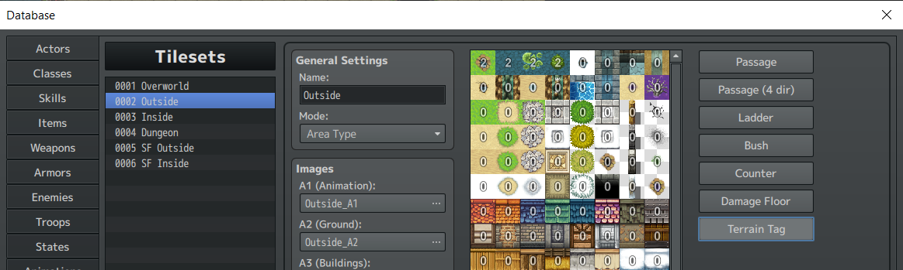
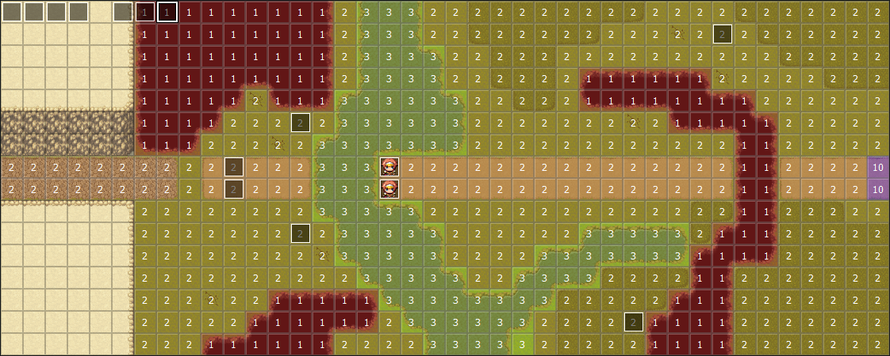
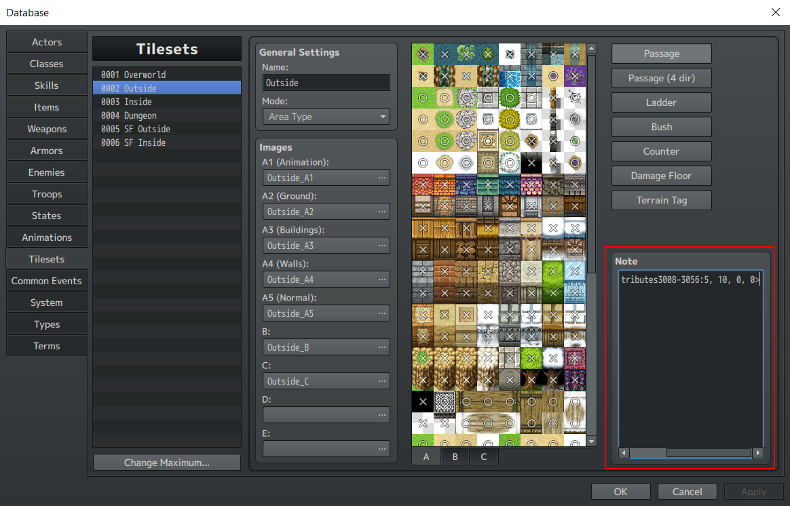
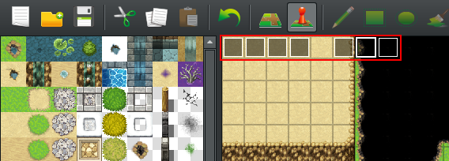

# SRW Engine MV User Manual V2.0

# Set-up

Extract the archive containing the sample project.<br>
In the project directory navigate to js/plugins/config and copy the "default" directory into a new "active" directory.

# Plugin Config

The config for the plugins that make up SRW Engine MV lives in the js/plugins/config directory inside two folders: default and active. The default folder contains the default settings, while the active folder contains settings modified for your game if applicable. The file in the default folder is overwritten by the file in the active folder with the same name. When the engine is updated only the defaults will be changed and the files in the active folder will never be touched. So if you want to customize any of these files for your game always first copy them to the active folder and modify the version in the active folder. <br>

## Engine.conf.js

This config file allows configuration of engine level settings.
```javascript
	var ENGINE_SETTINGS = {
		DISABLE_FULL_BATTLE_SCENE: false,// if true the option to show the battle DEMO will not be available
		BATTLE_SCENE: {
			SPRITES_FILTER_MODE: "NEAREST", // set the filtering mode for textures in the battle scene: NEAREST or TRILINEAR
			DEFAULT_ANIM: {// defines default animations
				DESTROY: 2 // the default destroy animation
			}
		},
		KEEP_ENEMY_SPRITE_ORIENTATION: false, // if true enemy sprites on the map will not be flipped
		ENEMY_TARGETING_FORMULA: "Math.min(hitrate + 0.01, 1) * damage", // the formula used by enemy AI to score potential targets. A target with a higher score will be preferred. hitrate and damage are the projected hit rate and damage the unit will deal to a target.
		DEBUG_SAVING: false, // if enabled the save option on the pause menu during a stage will behave like the regular save function, rather than as a quick save.
		CURSOR_SPEED: 4, // the default cursor speed
	}
```

# Terrain

This engine reuses some properties of terrain available in vanilla RPG Maker to assign additional terrain functionality.

## Terrain Cost

The terrain cost of a tile determines how many tiles of movement will be subtracted when a unit moves over it. By default each tile traveled uses up one unit of tile movement but if a tile has a higher cost assigned, additional movement will be spent to cross the tile.<br>

The terrain cost is set using the Terrain Tag functionality of RPG maker. To access this functionality in the editor go to Tools>Database>Tilesets. Select a tile set and click on the Terrain Tag option. 



Each tile can be assigned a Terrain Tag between zero and seven. A value of seven means seven additional tiles of movement will be subtracted for moving over the tile and a value of zero means no additional cost will be incurred for moving over the tile.

Terrain Cost will not be applied to units that are in a flying state.

## Regions

Regions are given additional importance when using SRW Engine MV.<br>
Regions are used to assign one of the five terrain types to every tile of a map. When using the region editor each region id in a column will make a tile the same terrain, only the first five columns are used.

* Column 1: Not passable (id 0, 8, 16, etc.)
* Column 2: Air (id 1, 9, 17, etc.)
* Column 3: Land (id 2, 10, 18, etc.)
* Column 4: Sea (id 3, 11, 19, etc.)
* Column 5: Space (id 4, 12, 20, etc.)

Additionally the engine provides a plugin command(addMapRegionHighlight) to highlight all tiles of a region on the map and provides a script command(isActorInRegion, isEnemyInRegion) to check if an enemy or ally is currently in a specific region. See the section on Event Scripting for more into on these commands.

Example map:



Note the use of region id 10 to create a separate area of the map that is still Land terrain but that can be highlighted separately from the other Land terrain.

## Terrain bonuses

Any tile in a tileset can be given modifiers for evasion, defense, HP regen and EN regen for units that stand on tiles of that type.<br>

Assigning these bonuses to a tile is done using metadata tags in the Note field of the tileset in the database.



Only tiles in tilesets A1-A5 and B are supported.<br>

There are two formats for the metadata. In this example the attributes assigned are: an increase of 5% to defense, and increase of 10% to evasion, 15% HP restored at the start of each turn and 20% EN restored at the start of each turn.

* \<srwTileAttributes2:5, 10, 15, 20\>: assigns attributes to tile id 2
* \<srwTileAttributes3008-3056:5, 10, 15, 20\>: assigns attributes to tile id 3008 up to but not including tile id 3056

The latter of the two formats is useful for assigning properties to autotiles.


For a detailed explanation on how to figure out the tile id of a tile [please refer to this tutorial.](https://forums.rpgmakerweb.com/index.php?threads/how-to-determine-your-tileid.91129/)


# Pilots

## General Notes

When making pilots it is important to remember that enemy and ally pilots should always be completely separate.<br>

If you have a character that appears as both throughout your game you must give them an entry as both an Ally and Enemy pilot.

## Ally Pilots
Ally Pilots are Actors in vanilla RPG Maker terms. Of the default RPG Maker properties only the Name, Face image and Class are used, with the class being the starting Mech for that particular pilot.<br>

The rest of the pilot properties are set using metadata tags in the note field. It is recommended to create a new character by copying an existing, fully defined, character and changing the properties as needed. The following is an annotated example:

#### Base stats
\<pilotSpecies:human\> Currently unused<br>

\<pilotBaseSP:45\> SP is used to cast Spirit Commands.<br>
\<pilotBaseMelee:120\> Determines damage for Melee attacks.<br>
\<pilotBaseRanged:165\> Determines damage for Ranged attacks.<br>
\<pilotBaseSkill:110\> Determines how often the until will perform a critical hit and how often a unit will take a critical hit.<br>
\<pilotBaseDefense:150\> Determines how much damage a unit takes.<br>
\<pilotBaseEvade: 90\> Determines how likely enemy attacks are to hit.<br>
\<pilotBaseHit:220\> Determines the unit's hit rate when attacking targets.<br>
\<pilotTerrain:AABA\> Air, Sea, Land, Space. Determines the pilot's performance on these terrains.<br>
\<pilotExpYield:50\>The exp yield listed here is the exp gained if the enemy defeated and the actor were at the same level. When the level is different the exp gain gets scaled accordingly.<br>
\<pilotPPYield:10\><br>

#### Stat growth rates

The stats for a pilot at any given level is calculated as: base\_stat + floor(level * growth\_rate)

\<pilotSPGrowth:2\><br>
\<pilotMeleeGrowth:0.8\><br>
\<pilotRangedGrowth:1.2\><br>
\<pilotSkillGrowth:0.9\><br>
\<pilotDefenseGrowth:1.4\><br>
\<pilotEvadeGrowth: 0.8\><br>
\<pilotHitGrowth:1.2\><br>

#### Spirits

A pilot can have up to 6 spirits.<br>
The format is: spirit\_id, level\_learned, cost

\<pilotSpirit1: 25,1,10\><br>
\<pilotSpirit2: 22,1,25\><br>
\<pilotSpirit3: 27,10,15\><br>
\<pilotSpirit4: 24,15,35\><br>
\<pilotSpirit5: 6,20,35\><br>
\<pilotSpirit6: 30,25,50\><br>

#### Abilities

Up to 30 entries can be listed.<br>
The format is: ability\_id, ability\_level, level\_learned<br>
The list can contain the same ability\_id twice but with a different ability level and learned level, this allows ability levels to go up as the character levels up.


\<pilotAbility1: 4,2,1\><br>
\<pilotAbility2: 31,1,1\><br>
\<pilotAbility3: 12,1,1\><br>

\<pilotAbility4: 4,3,5\><br>
\<pilotAbility5: 4,4,10\><br>
\<pilotAbility6: 4,5,15\><br>
\<pilotAbility7: 4,6,20\><br>


\<pilotAbilityAce: 36\>The ace ability for the pilot is a separate entry and only takes the ability\_id as a parameter.<br>

#### Personality

A pilot's personality determines how their Will changes when certain events occur. The Will change for each type of event can be specified:

\<pilotOnHitWill:1\> Applies when a pilot hits its target.<br>
\<pilotOnMissWill:-1\> Applies when a pilot misses its target.<br>
\<pilotOnDamageWill:2\> Applies when a pilot takes damage.<br>
\<pilotOnEvadeWill:3\> Applies when a pilot avoids an attack.<br>
\<pilotOnDestroyWill:3\> Applies when a pilot destroys a target.<br>


## Enemy Pilots
Enemy Pilots are Enemies in vanilla RPG Maker terms. Of the default RPG Maker properties only the Name is used.<br>
The rest of the pilot properties are set using metadata tags in the note field. It is recommended to create a new character by copying an existing, fully defined, character and changing the properties as needed.<br>

The metadata properties for enemies are mostly the same as for allies, so please refer to the previous section for more info. Enemy pilots have two additional properties:

\<faceName:Monster\>The name of the Face image file in the img/faces folder <br>
\<faceIndex:1\> The index of the Face that should be used, starting from at 1 for the top left most face and 8 for the bottom right most face

# Mechs

## General Notes

Unlike in vanilla RPG Maker, the Class/Mech of the unit is what determines what their sprite will be on the map.

When working with Mechs a couple of important things must be kept in mind:

* Enemy and Ally Mechs must be kept separate at all times. If a Mech appears as both an Ally and Enemy unit in the game a separate entry must be made for when it used as an Ally and when it is used as an Enemy. 
* Never assign multiple Allied Pilots to the same Mech entry. If multiple copies of the same Mech need to be used by allied pilots, each copy must have its own entry. This restriction does not apply to Enemy mechs.

## Definition

Mech are Classes in vanilla RPG Maker Terms. Of the default RPG Maker properties only the Name is used.<br>
The rest of the Mech properties are set using metadata tags in the note field. It is recommended to create a new Mech by copying an existing, fully defined, one and changing the properties as needed. The following is an annotated example:<br>

### Base stats

\<mechHP:6500\><br>
\<mechEN:330\> EN is consumed to perform some attacks.<br>
\<mechArmor:1650\> Determines how much damage the mech takes from enemy attacks.<br>
\<mechMobility: 80\> Determines how likely the mech is to be hit by enemy attacks.<br>
\<mechAccuracy:140\> Determines how likely the mech is to hit enemies.<br>
\<mechTerrain:BABA\> Air,Land,Sea,Space. Determines the mech's performance on these terrains.<br>
\<mechMove:4\> Determines how many tiles the mech can move by default.<br>
\<mechSize:M> S/M/1L/2L Determines the size of the mech, which influences evasion and damage taken.<br>
\<mechCanFly:0\> 0 for unable to fly, 1 for able to fly.<br>
\<mechAirEnabled:0\> 0 for unable to fly, 1 for able to fly.<br> 
\<mechLandEnabled:0\> 0 for unable to stand on land tile, 1 for able.<br>
\<mechWaterEnabled:2\> 0 for unable to stand on water tile, 1 for able, 2 for able and no move penalty in water.<br>
\<mechSpaceEnabled:1\> 0 for unable to stand on space tile, 1 for able.<br>
\<mechExpYield:150\>The exp yield listed here is the exp gained if the enemy defeated and the actor were at the same level. When the level is different the exp gain gets scaled accordingly.<br>
\<mechPPYield: 15\><br>
\<mechFundYield: 500\><br>

### Weapon upgrade costs

The upgrade costs for a mech's stats can be one of multiple types. The type defines how much each level of upgrades costs.

Currently two types are supported for stats:

0: \[2000, 4000, 6000, 8000, 10000, 10000, 15000, 15000, 15000, 15000, 10000, 10000, 10000, 10000, 10000\],<br>
1: \[2000, 3000, 5000, 5000, 5000, 10000, 10000, 15000, 15000, 15000, 10000, 10000, 10000, 10000, 10000\]

And one type for weapons:


0: \[12000, 17000, 23000, 30000, 38000, 47000, 57000, 68000, 80000, 93000, 90000, 90000, 90000, 90000, 90000\]

\<mechUpgradeWeaponCost: 0\><br>
\<mechUpgradeHPCost: 0\><br>
\<mechUpgradeENCost: 1\><br>
\<mechUpgradeArmorCost: 0\><br>
\<mechUpgradeMobilityCost: 0\><br>
\<mechUpgradeAccuracyCost: 1\><br>

### Sub-pilots

A mech can have any number of sub-pilots. The spirit commands of the sub-pilots are usable by the unit as a whole.
Swapping sub-pilots is not supported.

\<mechSubPilots:\[3,5\]\>: The ids of the sub-pilots.

### Transform

Units can be given the ability to transform into other units.

\<mechTransformsInto:1\>: The id of the mech into which the mech can transform.
\<mechTransformWill:0\>: The required will for transformation.
\<mechTransformRestores:0\> If 1 the mech will recover all HP and EN after transforming. If 0 the old HP and EN will carry over.

### Combining Units

Units can be given the ability to combine into other units. Combined units have the ability to split back into their components. The combine command will be available in the unit menu if all required units are adjacent on the map.

#### Mechs that combine

\<mechCombinesTo:5\>: The id off the mech into which the unit can combine.

#### Combined mechs

\<mechCombinesFrom:\[1,3\]\>: The ids of the mechs that are needed to combine into this unit. <br>
\<mechCombinedActor:1\>: The id of the main pilot for the combined mech.


### Inheriting upgrades

When working with transforming or combining mechs it usually desirable for the upgrade levels of the transformed or combined mech to match those of the base mech.

\<mechInheritsUpgradesFrom:1\>: The id of the mech from which the mech will inherit upgrade levels.

### Attacks

The attacks available to the mech, identified by a Weapon ID.<br>
If a mech should gain weapons during the game, a new Mech entry should be made and the pilot should be switched to the new Mech.

\<mechAttack0:1\><br>
\<mechAttack1:2\><br>

### Abilities


A Mech can have up to 6 abilities, identified by a Mech Ability ID.

\<mechAbility1:4\><br>

\<mechFullUpgradeAbility:20\> The Full Upgrade Ability is assigned separately.<br>

### Items

\<mechItemSlots:2\><br>

### Sprite info

\<srpgOverworld:Mech1,0\>The map sprite for the Mech: the name of the image in the img/characters folder and the index in the image. The index starts at 0 for the top left most sprite set and ends at 7 for the bottom right most set.<br>
\<mechBasicBattleSprite:harold\> The name of the image in the img/basic_battle folder.<br>

Image files for the battle scene are stored in the img/SRWBattleScene directory with a sub directory for each character. The directory for each character contains a main.png image which is the image that is used for the Mech in the battle scene.

\<mechBattleSceneSprite:harold\> The name of the sub directory in the img/SRWBattleScene folder that houses the image files for the Mech. <br>
\<mechBattleSceneSpriteSize:64\> The height and width of the main.png image for this mech.<br>
\<mechBattleSceneUseSpriter:1\> If 1 the sprite for this mech is a Spriter sprite. More info about Spriter sprites in the chapter on the battle animation system. <br>
\<mechBattleSceneShadowSize:1\> The size of the shadow displayed for the mech in the battle scene.<br>
\<mechBattleSceneShadowOffsetX:0\>The x offset for the shadow relative to the center point of the mech's sprite in the battle scene.<br>
\<mechBattleReferenceSize:3\> The world space size of the Mech's sprite. This size is used for determining the size and position of the unit's barrier.<br>
\<mechBattleSceneDeathAnim:1\> Specifies the id of a battle animation to be played when the mech is destroyed. If omitted the default death animation is used.

# Attacks

## Definition

Attacks are Weapons in vanilla RPG Maker Terms. Of the default RPG Maker properties only the Name is used.<br>
The rest of the Attack properties are set using metadata tags in the note field. It is recommended to create a new Attack by copying an existing, fully defined, one and changing the properties as needed. The following is an annotated example:<br>

\<weaponType:M\>M for melee, R for ranged<br>
\<weaponPostMoveEnabled:1\>1 if the weapon can be used after moving, otherwise 0<br>
\<weaponPower:3500\><br>
\<weaponMinRange:1\><br>
\<weaponRange:3\><br>
\<weaponHitMod:15\><br>
\<weaponCritMod:10\><br>
\<weaponAmmo:-1\>Total ammo for the weapon, -1 if the weapon does not use ammo<br>
\<weaponEN:5\>EN cost for using the weapon, -1 if the weapon does not have a cost<br>
\<weaponWill:-1\>Will requirement for the weapon, -1 if there is no requirement<br>
\<weaponTerrain:AA-A\>If a terrain value is "-" the weapon cannot be used on enemies who are currently on a tile of that terrain.<br>
\<weaponAnimId:3\>The battle scene attack animation id that will be played for this weapon. If no id is provided the default animation will play.<br>
\<weaponCategory:missile\><br> The particle type of the weapon. Missile, funnel, beam, gravity, physical or  "".	
 
Weapons can have up to two special effects.

\<weaponEffect0:0\><br>
\<weaponEffect1:1\><br>


\<weaponMapId: 0\>The id of the MAP attack definition for the weapon. If this tag is included the weapon will be treated as a MAP attack.<br>
\<weaponIgnoresFriendlies:1\> If set to 1 the map weapon will not damage friendly units. If set to 0, or if the property is omitted, it will.

## Combinations Attacks

Combinations attacks are attacks that require other units with a matching attack to either be adjacent to the current attacker or present on the field before the attack can be used. When a Combination Attack is used all participants will take the EN or ammo cost for the attack.

A combination attack has the following additional metadata:

\<weaponComboType:0> If 0 or omitted the attack can only be used if units with all required combo weapons are adjacent to each other and the attacker. If 1 the other units can be anywhere on the map.<br>

\<weaponComboWeapons:\[7,8\]\> The ids of the other weapons that are required for the attack. Only one weapon can be provide per unit, so if two weapons are required then 2 units will need to be available to provide them.

## MAP Attacks

MAP attacks are defined in: js/plugins/config/active/MapAttacks.conf.js<br>
A definition may look as follows: <br>

```javascript
this.addDefinition(
	0, //the id of the definition
	[[1,0],[1,1],[1,-1],[2,0],[2,1],[2,-1],[3,0],[3,1],[3,-1]], //the tiles for the range of the attack as seen when the attack is targeted to the right of the user
	{
		name: "Explosion",
		frameSize: 136, //the size of each frame of the sprite sheet for the attack's animation
		sheetHeight: 1, //the number of rows in the sprite sheet
		sheetWidth: 7, //the number of columns in the sprite sheet
		frames: 7, //the number of frames in the animation
		offset: {x: 96, y: 0},//the offset for the animation relative to the user, as seen when the MAP attack is targeted to the right of the user(a tile is 48x48)
		duration: 50,//the duration of the attack animation
		se: "SRWExplosion"//the sound effect to play with the animation
	},
	false, //if true the player will not be able to rotate the map attack
	{faceName: "Actor3", faceIdx: 7, text: "Marsha\nGet a load of this!"} // specifies a text box to show before the map attack animation plays. 
);
```

The definition defines the MAP attack as it should look when the user is targeting it to the right. The engine will automatically translate this when the targeting direction changes.


# Spirit Commands

Spirit commands are buff, debuff and healing commands that units can use when taking their turn, but only before moving. Spirit commands can apply to the own unit, another ally, an enemy, all allies or all enemies. Spirit commands consume SP to be used, but the cost is not part of the base definition and is instead defined when they are assigned to a Pilot. This allows Spirit commands to have different costs depending on the user.

Spirit commands are managed in: js/plugins/config/active/Spirits.conf.js

[A list of default Spirit commands is available here.](default_spirits.md)

The format of a Spirit command definition is as follows:

```javascript
this.addDefinition(
		0, //the id of the spirit
		"Love", //the display name of the spirit
		"Commands Accel, Strike, Alert, Valor, Spirit, Gain and Fortune will take effect.", //the display description of the spirit
		function(target){ //the effect function of the spirit, target is the actor that will be affected by the spirit command
			$statCalc.modifyWill(target, 10);
			$statCalc.setSpirit(target, "accel");
			$statCalc.setSpirit(target, "strike");
			$statCalc.setSpirit(target, "alert");
			$statCalc.setSpirit(target, "valor");
			$statCalc.setSpirit(target, "spirit");
			$statCalc.setSpirit(target, "gain");
			$statCalc.setSpirit(target, "fortune");
		},
		"self", //the targeting type of the spirit: self, ally, ally_all or enemy_all
		function(actor){ //this function is used to determine if the spirit can be used
			var activeSpirits = $statCalc.getActiveSpirits(actor);
			return ( 
				$statCalc.canWillIncrease(actor) ||
				!activeSpirits.accel ||
				!activeSpirits.strike ||
				!activeSpirits.alert ||
				!activeSpirits.valor ||
				!activeSpirits.spirit ||
				!activeSpirits.gain ||
				!activeSpirits.fortune
			);
		}, 
		null, //this function is used to determine if the spirit can be used for any target. Only applicable for "ally" type spirits
		{ // info for the animation when the spirit is used
			src: "Love", //the name of the image file in img/animations/spirits
			duration: 800 //the duration of the animation in milliseconds
		}
	)
```

# Abilities and effects

There are several types of special abilities and effects in SRW Engine MV: Pilot abilities, Mech abilities, Item effects and weapon effects.

## Pilot Abilities

Pilot abilities are managed in js/plugins/config/active/PilotAbilities.conf.js

Pilot abilities can be assigned to pilots. These abilities can have levels and can level up as the pilot levels up. For more information on assigning abilities please check the section on Pilots.<br>  
  
Pilots have a special ability called an Ace Ability that is unlocked once the pilot has shot down a certain amount of enemies. Ace Abilities are defined as regular abilities with an additional check in their isActive function to verify that the pilot has reached Ace status. 

[A list of default Pilot Abilities is available here.](default_pilot_abilities.md)


The format of a Pilot Ability definition is as follows: 

```javascript
	this.addDefinition(
		4, //the id of the ability
		"Prevail", // the display name of the ability
		"Hit, Evade, Armor and Critical go up as HP decreases.", // the display description of the ability 
		true, // true if the ability has a level, otherwise false
		false, //true if the ability is unique, otherwise false. Unique abilities are marked with a \* when they are display and they cannot be purchased
		function(actor, level){//the function implementing the effect of the ability. Actor is the unit that will be affected by the ability and level is the current level of the ability.
			var mechStats = $statCalc.getCalculatedMechStats(actor);		
			var targetSlice = Math.floor(mechStats.currentHP / mechStats.maxHP * 10);
			var hitEvadeMod = (level - targetSlice) * 0.05;
			if(hitEvadeMod < 0){
				hitEvadeMod = 0;
			}
			var armorMod = (level - targetSlice) * 0.1;
			if(armorMod < 0){
				armorMod = 0;
			}
			var critMod = (level - targetSlice) * 0.08;
			if(armorMod < 0){
				armorMod = 0;
			}
			return [
				{type: "hit", modType: "addFlat", value: hitEvadeMod * 100},
				{type: "evade", modType: "addFlat", value: hitEvadeMod * 100},
				{type: "armor", modType: "addPercent", value: armorMod},
				{type: "crit", modType: "addFlat", value: critMod * 100},
			];
		},// the function that determines if the ability is current active.
		function(actor, level){
			var mechStats = $statCalc.getCalculatedMechStats(actor);	
			var targetSlice = Math.floor(mechStats.currentHP / mechStats.maxHP * 10);
			return (targetSlice + 1) <= level;
		},
		[20,30,40,50,60,70,80,90,100],// the cost for upgrading each level of the ability.
		9// the max level of the ability.
	)
```

## Mech Abilities

Mech abilities are managed in js/plugins/config/active/MechAbilities.conf.js

Mech Abilities are assigned to mechs and are normally part of the mech definition and cannot be changed. For more information on how Mech abilities are assigned please see the section on Mechs.

Mechs have a special ability called a Full Upgrade Bonus which is unlocked when a mech is fully upgraded. Full Upgraded Bonuses are defined in the same way as regular mech abilities but they have an additional check in their isActive function to verify that a unit is fully upgraded.

[A list of default Mech Abilities is available here.](default_mech_abilities.md)

The format of a Mech Ability definition is as follows:

```javascript
	this.addDefinition(
		0, // the id of the ability
		"Double Image", // the display name of the ability
		"30% chance to evade any attack above 130 Will.", // the display description of the ability
		false, // unused
		false, // unused
		function(actor, level){ //the function implementing the effect of the ability.
			return [{type: "double_image_rate", modType: "addFlat", value: 0.3}];
		},
		function(actor, level){ // the function that determines if the ability is current active.
			return $statCalc.getCurrentWill(actor) >= 130;
		}
	);

```

## Item Effects

Item effects are managed in js/plugins/config/active/ItemEffects.conf.js

Mechs can hold items that give them certain abilities. Some items are consumables that only apply their effect once consumed. Consumables return after a stage has been completed.

[A list of default Items is available here.](default_items.md)

The format of an Item Effect definition is as follows:

```javascript

	this.addDefinition(
		0, //the id of the item
		"Booster", // the display name of the item
		"Movement +1.", // the display description of the item
		false, // unused
		false, // true if the item is a consumable, otherwise false
		function(actor, level){ // the function implementing the effect of the item
			return [{type: "movement", modType: "addFlat", value: 1}];
		},
		function(actor, level){ // the function that determines if the item is usable, normally always returns true
			return true;
		}
	);

```

## Weapon Effects

Weapon effects are managed in js/plugins/config/active/WeaponEffects.conf.js

Weapons can have special effects that apply or that they inflict when used. 

[A list of default Weapon Effects is available here.](default_weapon_effects.md)

The format of a Weapon Effect definition is as follows:

```javascript

	this.addDefinition(
		0, // the id of the effect
		"Barrier Piercing", // the display name of the effect
		"Ignores barriers on the target.", // the display description of the effect
		false, // unused
		false, // unused
		function(actor, level){ // the function implementing the effect of the item
			return [{type: "pierce_barrier", modType: "addFlat", value: 1}];
		},
		function(actor, level){// the function that determines if the item is usable, normally always returns true
			return true;
		}
	);

```


# Event scripting

## Stage control events

This engine introduces a couple of specific event types that will run when the engine is in a specific state.<br>
Ex.: Start of a stage, after a unit made an action, etc.<br>
They can be found at the top left of the demo stages.



These events have a metadata tag indicating their type.<br>
Ex.: \<type:battleStart\><br>

It is recommended to create all new stages by creating a copy of a demo stage so that all the basics for these events are in place.

### battleStart

The battleStart event runs when the stage first starts. This event is used to set up the stage as well as to show any story events that should occur before the stage starts.<br>
It will normally have the following responsibilities:

* Set the normal and sky battle background and parallax for the battle scene by using the setSRWBattleBg, setSRWBattleParallax1, setSRWSkyBattleBg and setSRWSkyBattleParallax1 plugin commands

* Set the stage theme song using the setStageSong plugin command

* Set the enemy upgrade level using the setEnemyUpgradeLevel plugin command

* Set the stage victory, loss and mastery conditions

* Spawn initial enemies using the this.addEnemy script command

* Play the stage BGM using the Play BGM command

* Fade in the screen from black using the FadeIn Screen command

* Showing the stage name using either a text command or by displaying an image

* Showing the stage conditions by using the this.showStageConditions script command

### actorTurn

The actorTurn event runs at the start of each actor turn. It can be used to have certain events occur at the start of a specific turn by using the Turns Passed(Stage) control variable.<br>
This command is also responsible for showing the next turn text using a formatted Text command.

### enemyTurn

The enemyTurn event runs at the start of each enemy turn. It can be used to have certain events occur at the start of a specific turn by using the Turns Passed(Stage) control variable.<br>
This command is also responsible for showing the next turn text using a formatted Text command.

### turnEnd

The turnEnd event runs at the end of a full turn (actor phase + enemy phase).

### beforeBattle

The beforeBattle event runs before each battle. The Actor Event ID, Enemy Event ID, Actor ID and Enemy ID control variables can be used to check which units are going to involved in the upcoming battle. This event can be used for before battle interactions between characters.

### beforeDestruction

The beforeDesctruction event will run after battle occurred but before any rewards are given and before any destroyed units play their destruction animations. The pending destruction of a unit can be canceled in this event. This event can be used to have bosses run away instead of being destroyed or to trigger defeat conditions if an ally unit will be destroyed.

### afterAction

The afterAction event runs every time a unit completes its turn. This is the event where checks for stage completion/loss requirements will usually will be done. It will then also contain scripting for the after stage story section, setting up deploys for the next stage and sending the player to the Intermission map. 

## Other event types

Events that are used for units can have special roles assigned to them using metadata as well.

* \<type: ship\>: Specifies that the event will be linked to a ship type unit. These events are used when automatically deploying ship units.
* \<type: ship_event\>: Specifies that the event will become a ship through a scripted deploy during the stage. These events are not used for automatic deployment. Events that will become ships must be tagged as such to ensure that they have proper z-indexing.
* \<type: actor\>: Specifies that the event will be linked to an actor pilot. These events become selectable positions when doing a manual deploy.

## Control Variables

The first two pages of Control Variables are reserved for specific functions in the engine:

* 0001 - Remaining Actors: The number of remaining actors on the stage. This variable is updated by the engine when allies are added or removed.
* 0002 - Remaining Enemies: The number of remaining enemies on the stage. This variable is updated by the engine when enemies are added or removed.
* 0003 - Turns Passed(Stage): The number of turns(one actor phase + one enemy phase) that has passed on the current stage.
* 0004 - Actor Event ID: The event ID of the current active actor
* 0005 - Enemy Event ID: The event ID of the current active enemy
* 0006 - Next Map: The id of the next map that will be loaded after the next intermission
* 0007 - Next Map X: The starting x coordinate for the cursor on the next map
* 0008 - Next Map Y: The starting y coordinate for the cursor on the next map
* 0009 - Next Deploy Info: Information for the deployment on the next map. Should be treated as read only!
* 0010 - SR Count: The total SR points earned by the player. This needs to be updated manually by the stage script when the player completes a mastery condition
* 0011 - Last stage ID: The ID of the previous stage.
* 0012 - Turn Count(Global): The total number of turns the player has taken across all stages
* 0013 - Actor ID: The actor ID of the current active actor
* 0014 - Enemy ID: The enemy ID of the current active enemy
* 0015 - Actors Destroyed: The number of allies that were destroyed on the current stage
* 0016 - Enemies Destroyed: The number of  
* 0017 - Mastery Condition Text
* 0018 - Victory Condition Text
* 0019 - Defeat Condition Text
* 0020 - Ship Count: The current number of active ships on the stage

Variables 0021-0060 are stageTemp variables that can be used to keep track of things over the course of a single stage.<br>
<b>The engine will automatically clear these when a new stage starts!</b>

## Switches

<b>The first page of switches is reserved for engine specific functions and should not be used!</b>

## Plugin commands

* SRPGBattle start|end

	This command starts or ends the SRPG mode of the engine.<br>
	Generally only called by the init or intermission map to start a new stage.
	
* Intermission start|end

	This command starts or end the intermission. Only called on the intermission map.

* unlockUnit class\_id
	Make the mech with the specified id available to the player.

* lockUnit class\_id
	Make the mech with the specified id not available to the player.

* SetLevel actor\_id level

* addKills actor\_id amount

* addPP actor\_id amount

* addExp actor\_id amount
		
* setStageSong song_id

	Sets the default song for the current stage.<br>
	When switching between actor and enemy phases this song will start playing.

* setSpecialTheme song\_id
	
	If set this song will override actor or enemy songs.
	
* clearSpecialTheme

* addItem item_id

	Adds one of the specified item to the inventory.
	
* addAllItems

	Adds one of each existing item to the inventory.
			
* removeItem


	Removes one of the specified item from the inventory.	

* addItemToHolder item\_id mech\_id slot

	Assigns an item to be held to a mech in a specific slot.<br>
	Will unequip any item previously held for that mech and slot.<br>
	Will fail if no free items of the type are available in the inventory!

* removeItemFromHolder mech\_id slot 	
	
* focusActor actor\_id

	If an actor with the specified id exists on the map the cursor will be set to its position.<br>	
	If the matching actor does not exist or the actor was erased, nothing happens. 
	
* focusEvent event\_id

	If an event with the specified id exists on the map the cursor will be set to its position.<br>
	If the matching actor does not exist or the actor was erased, nothing happens.<br>
	This command should be used to focus enemies, as those enemy ids will usually not be unique on the map!
	
* clearDeployInfo


	Clears all previous deploy info, should be used before setting up all the deploys for a map.

* setDeployCount amount

	Set the total number of particpants for the next deployment, ships not included.
	
* assignSlot slot actor\_id
	
	Assign an actor to a slot for the next deployment.

* assignShipSlot slot actor\_id
	
	Assign an actor to a ship slot for the next deployment.	<br>
	This actor should logically be a ship captain, but this is not strictly enforced.
	
* lockDeploySlot slot

	Prevent the player from changing a deploy slot in the intermission menu.<br>
	Units required for events after the next deploy should be assigned to a slot and then have that slot be locked.	
	
* unlockDeploySlot slot

		
	
* addMapHighlight x y color

	Highlight the tile on the map with the specified coordinates and color.<br>
	Color can be a string name, ex.: "white"	
	
* removeMapHighlight x y 

* addMapRegionHighlight region_id color

	Highlight all tiles on the map that are within the specified region.<br>
	Color can be a string name, ex.: "white"	
	
* removeMapRegionHighlight

* setEnemyUpgradeLevel level
	Sets the upgrade level for all enemies that will appear on the current stage.
	
* addPersuadeOption actor\_id event\_id var\_id

	Adds the option to use the persuade command for the actor with the specified id when they are adjacent tot the 	specified event. After using the persuade option the Control Variable with the specified id will be set to 1,  	which can then be checked for in the afterAction event to implement the conversation.	

* removePersuadeOption actor\_id event\_id

	Removes the specified persuade option. This command should be called after the conversation has occurred if 		the conversation is supposed to be one time only. 

* deployShips toAnimationQueue

	Deploys all ships according to the current deploy info. If toAnimationQueue is set to true the this.processUnitAppearQueue() command will need to be called to show the unit.

* deployAll toAnimationQueue

	Deploys all allies according the current deploy info. If toAnimationQueue is set to true the this.processUnitAppearQueue() command will need to be called to show the unit.

* deployAllLocked toAnimationQueue

	Deploys all allies that are in a locked slot according to the current deploy info. If toAnimationQueue is set to true the this.processUnitAppearQueue() command will need to be called to show the unit.

* deployActor actor\_id event\_id toAnimationQueue

	Deploys the specified actor to the specified event. If toAnimationQueue is set to 1 the this.processUnitAppearQueue() command will need to be called to show the unit.
 
* deploySlot slot toAnimationQueue

	Deploys the actor in the specified slot according to the current deploy info. If toAnimationQueue is set to 1 the this.processUnitAppearQueue() command will need to be called to show the unit.

* redeployActor actor\_id toAnimationQueue

	Deploys the actor with the specified id again. This can be used to update the actor's unit on the map after a class change. If toAnimationQueue is set to 1 the this.processUnitAppearQueue() command will need to be called to show the unit.

* moveEventToPoint event\_id x y follow

	Move the specified event to the specified coordinates on the map. A route is automatically generate in the same way as when moving a unit on the map. Script execution is paused while the event is moving. If follow is 1 the cursor and camera will follow the event as it moves. Only one event of this type can run at the same time.

* setEventFlying event\_id

	Put the specified event into a flying state if the unit is capable of flight.

* setEventLanded event\_id

	Put the specified event into a grounded state.


* enableFaction faction\_id

	Enables the specified faction. Faction 0 is for standard enemies and is enabled by default. Factions 1 and 2 are additional factions whose aggro can be configured with other commands. Enemies spawned as those other factions will only take their turns if the correct faction is enabled.

* disableFaction faction\_id

	Disables the specified faction.

* setFactionAggro faction\_id targets

	Set the aggro for the specified faction. Targets should be in the following format, ex.: 
["player",0,2]. This example will make members of the specified faction aggressive towards player units and units of faction 0(default enemies) and faction 2.

* clearFactionAggro faction\_id

	Clears all current faction aggro settings for the specified faction.

* transformEvent event\_id

	Transforms the event with the specified id. The unit for the event should be able to transform!

* combineEvent event\_id

	Combine the event with the specified id. The unit for the event should be able to combine and the other members of the combination should be deployed for best results.

* splitEvent event\_id 

	Split the event with the specified id. The unit  for the event should be a combined unit and the members of the combination should have been deployed on the stage before for best results.

* transformActor actor\_id

	Transforms the actor with the specified id. The unit for the actor should be able to transform!

* combineActor actor\_id

	Combine the actor with the specified id. The unit for the actor should be able to combine and the other members of the combination should be deployed for best results.

* splitActor actor\_id 

	Split the actor with the specified id. The unit for the actor should be a combined unit and the members of the combination should have been deployed on the stage before for best results.

* preventActorDeathQuote actor\_id 

	Prevents the default death quote from being played by making isActorDestructionQueued return false for the specified actor\_id. Only applicable in the beforeDestruction event.


* setSaveDisplayName name

	Set the name that will show up in the save file list for newly saved files. Spaces should be replaced by underscores in the command, ex.: "Debug\_Stage\_1" becomes "Debug Stage 1" on the file select screen.
	
* setStageTextId id

	Set the special text id for text on this stage. See the chapter on the Battle Text Editor for more info on special text.

* setEventWill event\_id amount
	
	Set the will of the unit for the specified event.

* setActorWill actor\_id amount
	
	Set the will of the actor unit with the specified id.
	
* makeActorAI actor\_id
	
	Make the actor with the specified ID AI controlled.
	
* makeActorControllable actor\_id

	Make the actor with the specified ID controllable by the player.	

	
* setActorEssential actor\_id
	
	Mark the actor with specified ID as essential. Essential actors can not board ships.
	
* setActorNonEssential actor\_id
	
	Mark the actor with specified ID as non-essential.		
	
* setDefaultBattleEnv env\_id
	
	Set the default battle environment for the stage to the specified environment id.
	
* setSkyBattleEnv env\_id

	Set the sky battle environment for the stage to the specified environment id.
	
* setRegionBattleEnv region\_id env\_id

	Set the standard battle environment for all tiles in the specified region to the specified environment id.		

* setRegionSkyBattleEnv region\_id env\_id

	Set the sky battle environment for all tiles in the specified region to the specified environment id.

## Script commands

These added commands can be used in Script commands while making event scripts.<br>
They can also be used as conditionals in IF statements.

* this.setMasteryText(text)

	The text for "Win condition", "Defeat condition" and "Mastery condition" will be automatically printed and should not be included.
	
* this.setVictoryText(text) 

	The text for "Win condition", "Defeat condition" and "Mastery condition" will be automatically printed and should not be included.

* this.setDefeatText(text)  

	The text for "Win condition", "Defeat condition" and "Mastery condition" will be automatically printed and should not be included.
	
* this.showStageConditions()

	Shows a text box using the values set with the previous commands.
	
* this.isActorDestructionQueued(actor\_id)

	To be used as a conditional in the before_destruction event.<br>
	Will be TRUE if the actor with the specified id was defeated and is about to be destroyed.
	
* this.isEnemyDestructionQueued(enemy\_id)

	To be used as a conditional in the before_destruction event.<br>
	Will be TRUE if the enemy with the specified id was defeated and is about to be destroyed.
	
* this.isEventDestructionQueued(event\_id)


	To be used as a conditional in the before_destruction event.<br>
	Will be TRUE if the event with the specified id was defeated and is about to be destroyed.	
	
* this.isActorBelowHP(actor\_id)

	To be used as a conditional in the before_destruction or after_action event.<br>
	Will be TRUE if the HP of the actor with the specified id is below the specified value.
	
* this.isEnemyBelowHP(enemy\_id)

	To be used as a conditional in the before_destruction or after_action event.<br>
	Will be TRUE if the HP of the enemy with the specified id is below the specified value.

* this.isEventBelowHP(event\_id)

	To be used as a conditional in the before_destruction or after_action event.<br>
	Will be TRUE if the HP of the event with the specified id is below the specified value.	

* this.cancelActorDestruction(actor\_id) 

	Cancel the destruction animation and erasure of an actor that is about to be destroyed.<br>
	To be used in the before_destruction event.
	
* this.cancelEnemyDestruction(enemy\_id) 

	Cancel the destruction animation and erasure of an enemy that is about to be destroyed.<br>
	To be used in the before_destruction event.<br>
	This can be used for bosses that run away when destroyed etc.

* this.addEnemy(toAnimQueue, eventId, enemyId, mechClass, level, mode, targetId, items, squadId, targetRegion, factionId)

	Spawn an enemy on the map, the event that will be used must already exist.<br>
	The following can be set:<br>
		* toAnimQueue: if 1 the enemy will not be spawned right away, but stored until the processEnemyAppearQueue command is called. If 0 the enemy appears instantly.
		<br>	
		* eventId: the id number of the event
		<br>
		* enemyId: the id number of the enemy pilot 
		<br>
		* mechClass: the id number of the mech/class for the enemy
		<br>
		* level
		<br>
		* mode: "stand" for stationary enemies that start moving once provoked, "fixed" for enemies that will never move but will still attack units in range, "disabled" for units that will never act or counterattack, otherwise ""
		<br>
		* targetId: the actor id of the actor this enemy should prioritize
		<br>
		* items: an array with the id numbers of the items the enemy will hold. Ex.: [10] or [10,11]. The first item in the list will drop from the enemy when it is defeated.
		<br>
		* squadId: all enemies that are assigned the same squad id will be activated if any member of the squad is activated <br>
		* targetRegion: the id of the region that the enemy should move towards<br>	
		* factionId: the id of the faction the unit will be assigned to. Factions 0, 1 and 2 are available with faction 0 being the default enemy faction. If omitted units will be assigned to faction 0.	

A setting can be left blank by entering "" as its value.	
	
* this.addEnemies(toAnimQueue, startId, endId, enemyId, mechClass, level, mode, targetId, items, squadId, targetRegion)
	
	The parameters for this command are the same as for addEnemy, with the exception of:<br>
		* startId: the starting event id 
		<br>
		* endId: the final event id 
		<br>
	This command will turn all the event ids between startId and endId into enemies with the same properties.

* this.processEnemyAppearQueue()

	Spawns all enemies that are currently in the queue with their spawn animation.<br>
	Event processing will automatically wait for all enemies to be spawned before continuing execution.
	
* this.processUnitAppearQueue()
	Spawns all units that are currently in the queue with their spawn animation.<br>
	Event processing will automatically wait for all units to be spawned before continuing execution.

* this.processDisappearQueue()
	Erases all units that are currently in the queue with their disappear animation.<br>
	Event processing will automatically wait for all units to disappear before continuing execution.
	
* this.manualDeploy()
	Shows the deployment selection window and lets the player select deployment positions. Event processing will automatically wait for all units to be spawned before continuing execution.
	
* this.destroyEvent(event\_id)

	Destroy the specified event and play its death animation.
	
* this.destroyEvents(startId, endId)

	Destroy the event between startId and endId and play their death animations.<br>
	The death animations will all play at the same time!

* this.eraseEvent(event_id, toAnimationQueue)

	Remove the specified event without an explosion animation. If toAnimationQueue is true the this.processDisappearQueue script command will need to be called to erase the event.
	
* this.eraseEvents(startId, endId, toAnimationQueue)

	Remove the events between startId and endId. If toAnimationQueue is true the this.processDisappearQueue script command will need to be called to erase the event.
	
* this.playerMoveTo(x, y)

	Move the cursor to the specified coordinates, the cursor will move from its start position to its end position with visible motion.
	
* this.cursorMoveTo(x, y)

	Instantly move the cursor to the specified coordinates.

* this.isActorInRegion(actor\_id, region\_id)

	Can be used as a conditional to detect if the actor with the specified actor id is currently on a tile from the region with the specified id.<br>
	If actor_id is -1 this function will detect if any actor is in the region.
	
* this.isEnemyInRegion(enemy\_id, region\_id)

	Can be used as conditional to detect if the enemy with the specified enemy id is currently on a tile from the region with the specified id.<br>
	If enemy_id is -1 this function will detect if any enemy is in the region.

* this.getActorKillCount(actor\_id)
	Returns the current amount of kills the actor with the specified id has.	

	
* this.setBattleMode(event\_id, mode)

	Set the battle mode for the event with the specified event id. If the event is an enemy unit the following modes are available: "stand" for stationary enemies that start moving once provoked, "fixed" for enemies that will never move but will still attack units in range, "disabled" for units that will never act or counterattack, otherwise "". If the event is an actor unit only "disabled", "fixed" and "" are available.<br>
	If the enemy is part of a squad their squad mates will also be updated!

* this.setActorBattleMode(actor\_id, mode)
	Set the battle mode for the actor with the specified id: "disabled", "fixed" and "" are available
	
* this.setBattleModes(start\_id, end\_id, mode)

	Set the battle mode for the enemies tied to the events with and id between start id and id.

* this.setSquadMode(squad_id, mode)canObtainSRPoint

	Set the battle mode for all enemies that are part of the specified squad.<br>

* this.setTargetRegion(event\_id, region\_id)

	Set the target region for the enemy with the specified event id.<br>
	
* this.setActorTargetRegion(actor\_id, region\_id)

	Set the target region for the actor with the specified id.<br>	
	
* this.turnEnd()

	End the turn of the unit currently taking its turn.

* this.isDeployed(actor\_id)
	
	Can be used as conditional to check if the actor with the specified id is currently deployed.
	
* this.isSquadWiped(squad\_id)

	Can be used as a conditional to check if the enemy squad with the specified id is currently wiped out.

* this.canObtainSRPoint()

	Should always be used to check if the SR point is still obtainable on the stage before awarding it. This will 	    return false if the player has previously had a Game Over on the current map.

* this.awardSRPoint()

	Grants the SR point for the current stage. Does not award the point if the SR point is locked for the current stage. If the point was newly awarded it automatically displays the reward text and plays a sound effect.	
	
* this.showEnemyPhase()

	Show text declaring the start of an enemy phase. Automatically shows the correct faction color and displays "Ally Phase" instead if a faction is configured to be friendly to the player.	

* this.applyEventSpirits(event\_id, spirit\_ids)

	Apply spirits effects to the unit with the specified event id. Ids are provided as an array, ex.: \[1,4,5\]. The animation for the spirits will play automatically.

* this.applyActorSpirits(actor\_id, spirit\_ids)

	Apply spirits effects to the actor unit with the specified id. Ids are provided as an array, ex.: \[1,4,5\]. The animation for the spirits will play automatically.
	
## Battle Text Editor

[Link](battle_text_editor.md)

## Battle Environment Editor

[Link](battle_environment_editor.md)

## Attack Editor

[Link](battle_scene_editor.md)